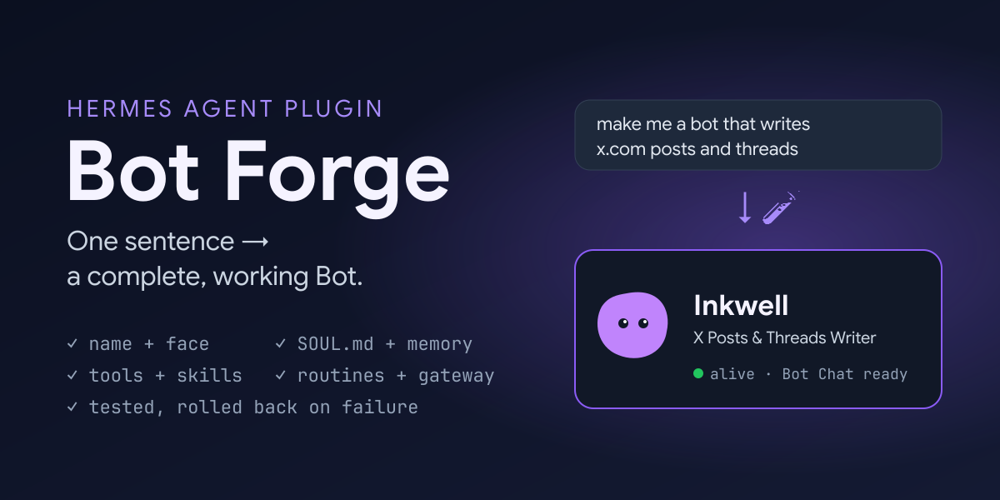
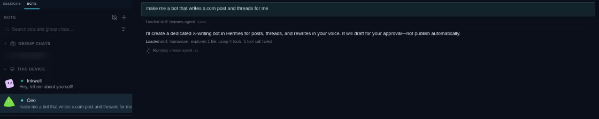
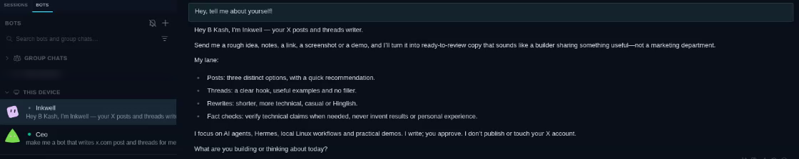

<p align="center">
  <a href="https://github.com/BkashJEE/hermes-bot-forge/actions/workflows/tests.yml"></a>
</p>

<p align="center">
  
</p>

# 🧪 Hermes Bot Forge

**Say "make me a social media manager" — your Hermes agent builds that Bot.**

Bot Forge is a [Hermes Agent](https://github.com/NousResearch/hermes-agent) plugin that lets any agent spawn a complete, working [Bot Mode](https://hermes-agent.nousresearch.com/docs/user-guide/bot-mode) Bot from one sentence — no New Agent dialog, no setup:

| The new Bot gets | |
|---|---|
| 🪪 **Identity** | a unique, Proper Case name and a blob face in the Bots roster |
| 📜 **SOUL.md** | written by your agent for that one job |
| 🧠 **Memory** | starter facts, plus what Hermes already knows about you |
| 🛠️ **Tools & skills** | file, web and browser, plus what the role needs |
| ⏰ **Routines** | optional cron jobs that post into its Bot Chat |
| 💬 **Bot Chat** | opened with the Bot introducing itself |
| 🔌 **Gateway** | a background service, started and enabled on login |

Every step is checked, and the whole Bot is rolled back if one fails.

## Demo

**1. Ask any Bot for a new teammate.** It checks the roster, designs the Bot and calls `create_agent` — the new Bot (Inkwell) appears in the roster while it works:



**2. The new Bot is already alive.** Its Bot Chat opens with it introducing itself:



---

## Onboarding

### 1. Requirements

- Hermes Agent **0.21+** with the `hermes` CLI on your `PATH`
- Hermes Desktop for Bot Mode (the CLI works too — Bots are profiles)
- **Linux and macOS are tested.** Windows is not: Bots are still created and work from the CLI, but gateway services and sandboxes are skipped there

### 2. Install

```bash
hermes plugins install BkashJEE/hermes-bot-forge
```

### 3. Enable it where you chat

Plugins are opt-in **per profile**. Enable Bot Forge on each profile that should be able to create Bots — your main profile, and any "manager" Bot:

```bash
hermes plugins enable bot-forge              # the default profile
hermes -p ceo plugins enable bot-forge       # a Bot named "ceo"
```

If `enable` asks to grant tool overrides, answer **no** — Bot Forge doesn't override anything.

### 4. Restart Hermes

```bash
hermes gateway restart
hermes -p ceo gateway restart   # for each profile you enabled
```

Then quit and reopen **Hermes Desktop**.

### 5. Check it's loaded

```bash
hermes bot-forge-doctor
```

It tells you exactly what is missing — a profile you forgot to enable, a gateway still running the old code (the usual reason the tools never appear), a model that needs a per-Bot sign-in, and which sandbox backends this machine can run. Or, the long way:

```bash
hermes plugins list | grep bot-forge
```

Or ask your agent: *"what tools do you have for creating agents?"* — it should name `create_agent`, `update_agent`, `list_agents` and the rest.

### 6. Make your first Bot

Open **Bot Mode**, click the Bot you enabled, and type:

> make me a bot that writes x.com posts and threads

Wait 1–3 minutes. The reply looks like:

```
🧪 Inkwell is alive — find it in Bot Mode.
job: turns ideas, links and demo notes into X posts and threads
brain: gpt-6-astra   tools: browser, file, web, …
```

Click the new Bot — its Bot Chat already has its introduction.

### 7. Choose how new Bots sign in

New Bots inherit the model of the Bot that created them. Whether they can use it right away depends on the provider:

| Your model's provider | What happens | What to do |
|---|---|---|
| **API key** (OpenRouter, OpenAI API, Anthropic API, …) | Works immediately — keys are copied to new profiles | Nothing |
| **Local model** (llama.cpp, Ollama, LM Studio) | Works immediately | Nothing |
| **OAuth sign-in** (ChatGPT/Codex, Claude subscription, …) | The Bot is created; the result tells you it needs a sign-in | Run the command it gives you once per Bot, **or** set a `fallback_model`, **or** see *share one login* below |

---

## Settings

Set per profile under `plugins.entries.bot-forge.settings` in that profile's `config.yaml`:

```yaml
plugins:
  entries:
    bot-forge:
      settings:
        inherit_model: true
        fallback_model: {}
        probe_local_models: false
        install_gateway: true
        journal_enabled: true
        suggest_connectors: true
        allow_delete: false
```

| Key | Default | Meaning |
|---|---|---|
| `inherit_model` | `true` | New Bots use the model of the profile that asked for them, like Bot Mode's New Agent. |
| `fallback_model` | `{}` | Model to switch a Bot to when its inherited model can't sign in, e.g. `{default: qwen3, provider: custom, base_url: http://127.0.0.1:8080/v1}`. |
| `probe_local_models` | `false` | With no `fallback_model`, look for a local llama.cpp / Ollama / LM Studio server to fall back to. |
| `install_gateway` | `true` | Install and start a gateway service per Bot (skipped on Windows). |
| `journal_enabled` | `true` | Give new Bots a private, append-only work journal for outcomes, evidence and next steps. |
| `allow_delete` | `false` | Let `delete_agent` work at all. Off by default — an agent should not be able to destroy a Bot on its own. |
| `backup_before_delete` | `true` | Export the Bot to a `.tar.gz` before deleting it, so it can be restored. If the backup fails, the delete is refused. |
| `allow_secrets` | `false` | Let `share_agent` write / `import_agent` accept a template the secret scanner marked BLOCK. Operator-only; the model cannot pass it as an argument. |
| `suggest_connectors` | `true` | After building a Bot, suggest matching servers from Hermes' MCP catalog. Suggestion only — connecting an account always needs you. |

### Optional: share one login across Bots

The plugin itself never touches credentials. If you want OAuth models to work in new Bots with no per-Bot sign-in, there is an **unsupported** helper you run yourself:

```bash
python extras/share_login.py <bot-name>
```

It points that Bot's `auth.json`/`auth.lock` at the root profile's. Hermes deliberately gives every profile its own login, so understand the trade-off first: a logout in any linked Bot affects all of them, every linked Bot can use every provider login in your root profile, and a Hermes update may undo the links. POSIX only. Undo with `rm <profile>/auth.json <profile>/auth.lock`.

---

## Tools

Thirteen tools, all driven by plain requests in chat:

| Tool | Say this | What it does |
|---|---|---|
| `create_team` | *"set me up a content team"* | Builds a whole team at once: a lead plus up to 6 specialists, each reporting to it. The lead learns the roster and delegates. |
| `teach_agent` | *"remember how I write my weekly report"* | Saves a procedure as a skill the Bot keeps and loads when the job comes up. |
| `create_agent` | *"make me a bot that writes X posts"* | Builds a Bot: name, face, SOUL.md, memory, tools, skills, routines, approvals, Bot Chat intro, gateway. |
| `update_agent` | *"make Inkwell funnier"*, *"give Atlas the browser"* | Edits a Bot in place — persona, name, description, memory, tools, skills, model, face, routines. Backs up what it replaces. |
| `copy_agent` | *"make another one like Inkwell, for LinkedIn"* | Duplicates a Bot under a new name (no chat history, no routines). |
| `list_agents` | *"what bots do I have?"* | Roster with description, model, routine count and hidden state. |
| `check_install` | *"the tools aren't showing up"* | Checks the install itself: enabled profiles, whether each gateway runs the current code, Bot Mode, model sign-in, sandbox backends. |
| `check_agents` | *"how are my bots doing?"* | Read-only health check: routines that run too often (and their cost in runs/day), paused or never-run routines, unused Bots, stopped gateways, a persona missing its name or approvals. |
| `agent_journal` | *"what did Inkwell work on this week?"* | Enables, appends to, and reads a Bot's dated work journal. Entries capture outcomes and evidence, never credentials or private reasoning. |
| `ask_agent` | *"ask Inkwell for 3 post ideas"* | Sends a task to another Bot and returns its reply. |
| `share_agent` | *"share Inkwell with a friend"* | Writes a readable `.botforge.json` template — persona, its own memory, tools, skills, routines. **Never chat history, facts about you, or keys**, and secret-scanned (CLEAN / WARN / BLOCK). `mode: backup` makes a full private backup instead. |
| `import_agent` | *"import this bot"* | Builds a Bot from a `.botforge.json` template (scanned again), or restores a backup. |
| `hide_agent` | *"hide Inkwell from the list"* | Hides or unhides it in the roster. It keeps running. |
| `delete_agent` | *"delete Inkwell"* | Permanent. **Off unless you enable it**, and it must repeat the Bot's exact name. |

### Start from a proven template

Five starters, modelled on the most-used Grok Bot patterns:

| Template | Bot | What it does | Routine |
|---|---|---|---|
| `chief-of-staff` | Marshal | Routes work to specialists, keeps open loops, pings you only when you must act | 7:00 brief, 18:00 handoff (weekdays), Friday 16:00 review |
| `morning-brief` | Dawn | Calendar, what's waiting on you, 3 headlines — drafts only | 7:30 weekdays |
| `research-digest` | Scout | What changed on your topics in the last 24 hours, sourced | 8:00 daily |
| `competitor-watcher` | Lookout | Reports real changes on competitors' pricing, product and hiring pages | 9:00 weekdays |
| `engineering-outer-loop` | Foreman | Failing checks, stuck PRs, new issues → small tasks. Never writes or merges code | 9:30 weekdays |

> make me a chief of staff from the template

Any field you give overrides the template's, so *"a morning brief bot called Sol that also covers crypto"* works.

### A team in one sentence

> set me up a content team

builds a lead plus its specialists, each with one job, each reporting to the lead, each introduced in its own Bot Chat. A member that fails is rolled back on its own — the rest of the team stands.

### A Bot that tells you where your request stands

Every new Bot starts its reply with one emoji for the state of your request:

| | |
|---|---|
| 👀 | picked it up, working on it |
| 💬 | answering now |
| ✅ | done |
| ✋ | needs your approval before going further |
| ⚠️ | blocked, or something failed |
| ⏳ | scheduled for later |

**In Hermes Desktop the same status lands on your own message as a tapback**, the moment you send it: 👀 while the Bot works, then ✅ / ✋ / ⚠️ for how it ended. The plugin places that reaction itself — it needs *Settings → Appearance → Message Reactions* on, and switches off with `ack_tapback: false`.

Everywhere else, the state rides on the reply: one emoji, at the very start, then the answer as normal — it is never the whole reply. Because it rides on the reply itself, it works the same in Hermes Desktop, an editor client, the CLI, a cron run or a messaging platform.

> This deliberately does **not** use Hermes' emoji tapbacks: `react_to_message` is documented as a human touch, "never as a status signal", and a Bot told to do both follows neither.

Turn it off for a Bot with `create_agent(ack_reactions=false)`, or on for an older Bot:

> turn on acknowledgements for Inkwell

### Give a Bot its own computer

A Bot with `terminal` or `code_execution` runs commands on **your** machine by default — the same weakness people hit with other bot platforms, where every Bot shares one computer and one set of logins. Ask for a sandbox instead:

> make me a coding bot, sandboxed

`create_agent(sandbox="docker")` puts that Bot's shell in its own container: it cannot read your files and cannot block the other Bots. `singularity` and `apptainer` work too. If the backend is not usable on this machine, the call is **refused before any Bot is created**, with the reason. `check_agents` reports each Bot's sandbox and flags shell-capable Bots that run on the real machine.
### A journal for work that survives the chat

Every new Bot gets a private `journal/YYYY-MM-DD.md` log. After meaningful work it records a short factual entry:

- what it tried and the observable outcome
- evidence such as a file, command, link or measurement
- blockers and the next step

Routine conversation is skipped. Credentials, facts unrelated to the Bot's job, private reasoning and hidden chain-of-thought are refused. Journals stay local, are excluded from shareable `.botforge.json` templates, and are included only in explicit private backups.

For a Bot created before this feature:

> enable journaling for Inkwell

Then ask *"what did Inkwell work on this week?"* to read recent entries.

### Cost and safety built in

- **Draft-first by default.** Every Bot is born with approval checkpoints — sending/publishing, spending money, deleting data — unless you explicitly ask for none.
- **No runaway routines.** Schedules faster than every 30 minutes are refused unless you explicitly ask (every run is a model call; every 15 minutes is 96 runs a day).
- **Nothing private leaves in a share.** Templates carry the Bot's design, never your chats, your facts or your keys — and they're scanned for secrets on the way out and on the way in.
- **One identity per Bot.** Renaming, copying or importing rewrites the persona's name instead of stacking a second one, so a Bot never introduces itself as another.

### Guardrails a new Bot is born with

`create_agent` takes an `approvals` list and a `reports_to` Bot, written into the new Bot's SOUL.md and memory:

> **Ask first** — never do these without the user saying yes: publish or send anything; spend money; delete files.
> **Escalate to** — @ceo for scope, priorities and final calls.

So a Bot that drafts posts never publishes one, and knows who to escalate to.

Bundled skill: `bot-forge:bot-forge` — role defaults, naming rules and a SOUL.md template your agent follows.

## How it works

`create_agent` runs `forge.py` in a subprocess with a clean environment (Hermes agent terminals point `HOME`/`HERMES_HOME` at the calling profile):

1. **Name check** — against live profiles, display names and Bot titles; generic or taken names are refused with suggestions *before* anything is created
2. `hermes profile create <id> --clone-from default` — messaging channels are left behind
3. **Bot Mode metadata** in `profile.yaml` (`ui_meta.hermes-bots`: title, description, blob face) — the same shape Desktop's New Agent dialog saves
4. **SOUL.md** (guaranteed to state the Bot's own name), `memories/MEMORY.md`, and `memories/USER.md` minus entries that name the assistant — otherwise the new Bot adopts another Bot's name
5. **Journal** — private, dated Markdown entries plus a concise factual journaling policy
6. **Config** — `platform_toolsets.cli`, unrelated skill categories disabled (not deleted), inherited model
7. **Routines** — `hermes cron create … --deliver bot-chat:<id>`
8. **Smoke test** — the kickoff message in its `Bot Chat`
9. **Gateway** — `hermes -p <id> gateway install --start-now --start-on-login`

Any failure after step 2 deletes the profile.

> **Note:** step 3 writes Desktop's Bot Mode metadata directly. It isn't a public API and may change between Hermes releases.

## What makes it different

| | Grok Bots | OpenMausBot | OpenClaw | **Bot Forge** |
|---|---|---|---|---|
| Build a Bot from one sentence, no dialog | partial | roster UI | config/CLI | ✅ |
| Tested before you get it, rolled back on failure | — | — | — | ✅ |
| Persona file you can read and edit | instructions | `SOUL.md` | `SOUL.md` | ✅ `SOUL.md` |
| Edit by chatting | UI | UI | delegation tool | ✅ `update_agent` |
| Share / import a Bot | templates | markdown teams | ClawHub | ✅ `share_agent` |
| Approval checkpoints written in at birth | set later | permission cards | policy | ✅ `approvals` |
| Whole team from one sentence | — | markdown file | — | ✅ `create_team` |
| Teach a skill by chatting | ✅ | playbooks | ClawHub | ✅ `teach_agent` |
| Connector suggestions for the job | ✅ | ✅ | — | ✅ from Hermes' MCP catalog |
| Routine cost health check | community bots | — | — | ✅ `check_agents` |
| Secret scan on shared templates | community bots (Bouncer, Vet) | — | — | ✅ built in |
| Chat history excluded from shares | ✅ | — | — | ✅ |
| Runs entirely on your machine | — | ✅ | ✅ | ✅ |
| Per-Bot sandbox chosen at creation | — (one shared computer) | — | — | ✅ `sandbox` |
| Every reply says where the request stands | — | — | — | ✅ built into every Bot |
| Install doctor | — | — | — | ✅ `hermes bot-forge-doctor` |

## Troubleshooting

| Symptom | Fix |
|---|---|
| Agent asks questions instead of building | Say "bot" or "agent" in the request, e.g. *"make me a bot that…"* |
| Agent doesn't know `create_agent` | Run `hermes bot-forge-doctor` — usually the profile isn't enabled or the gateway still runs the old code |
| "name … is taken" | Expected — your agent picks another name automatically |
| New Bot says it needs a sign-in | See step 7 |
| New Bot doesn't appear in the roster | Click another Bot and back, or reopen Hermes Desktop |
| Gateway "not started" | Run `hermes -p <bot> gateway install --start-now` and read its output |
| An edit didn't take | Changes apply on the Bot's next turn; send it a message. Previous files are in `<profile>/backups/bot-forge/` |
| `delete_agent` refuses | By design: set `allow_delete: true`, or run `hermes profile delete <name>` yourself |

## Uninstall

```bash
hermes plugins disable bot-forge
hermes plugins remove bot-forge
```

Bots you created stay. Remove one with `hermes profile delete <name>`.

## Development

```bash
python -m unittest discover -s tests
hermes plugins validate .
hermes plugins doctor .
```

## License

MIT © Bikash Joshi
