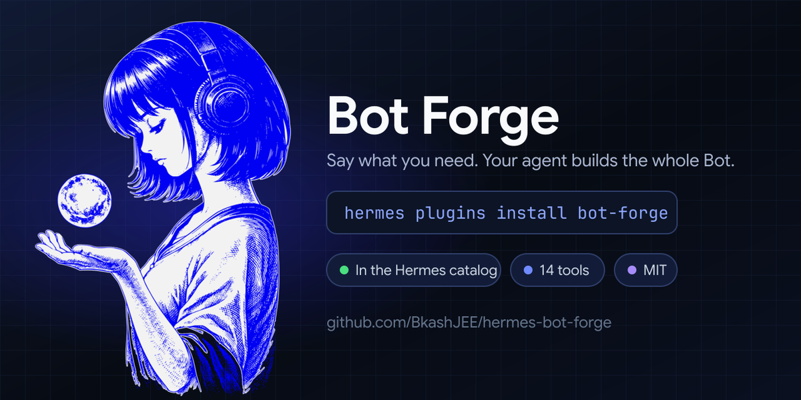
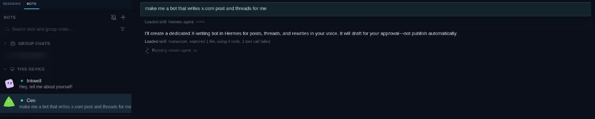
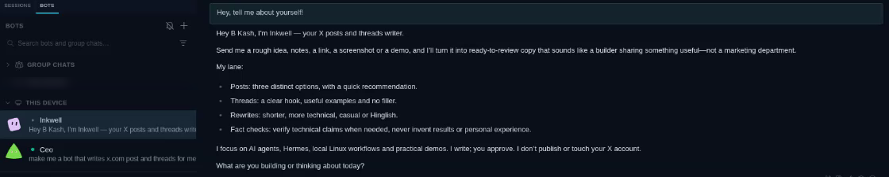

<p align="center">
  
</p>

<p align="center">
  <a href="https://hermes-agent.nousresearch.com/docs/plugins/"></a>
  <a href="https://github.com/BkashJEE/hermes-bot-forge/actions/workflows/tests.yml"></a>
  <a href="https://github.com/BkashJEE/hermes-bot-forge/releases"></a>
  <a href="LICENSE"></a>
</p>

# Hermes Bot Forge

**Describe the job. Reuse what fits; provision a new Bot when it needs its own persistent role.**

```bash
hermes plugins install bot-forge
```

<p align="center">
  
</p>


Bot Forge is a [Hermes Agent](https://github.com/NousResearch/hermes-agent) plugin that lets any agent spawn a complete, working [Bot Mode](https://hermes-agent.nousresearch.com/docs/user-guide/bot-mode) Bot from one sentence — no New Agent dialog, no setup:

| The new Bot gets | |
|---|---|
| 🪪 **Identity** | a unique, Proper Case name and a blob face in the Bots roster |
| 📜 **SOUL.md** | written by your agent for that one job |
| 🧠 **Memory** | starter facts, plus what Hermes already knows about you |
| 🛠️ **Tools & skills** | file, web and browser, plus what the role needs |
| ⏰ **Routines** | optional cron jobs that post into its Bot Chat |
| 💬 **Bot Chat** | introduction attempted; sign-in may still be needed |
| 🔌 **Gateway** | live host serving checked; a hot-rescan is requested when needed |

Creation failures attempt cleanup of that Bot. Sign-in and gateway readiness may remain
pending; the result says which. A team is not an all-or-nothing transaction.

### Does this job need a new Bot?

For a generic job or team request, the existing bundled skill asks the caller to inspect the
roster and relevant skills/routines first. Reuse an existing owner, a skill, temporary delegation
or a routine when sufficient. Create a new profile for a justified persistent responsibility,
state or configuration difference, not just a new specialty. Profiles are not security sandboxes.

This is advisory guidance, not a deterministic classifier or a new planning service. Explicit
authorized profile creation remains direct, with the existing duplicate and safety checks.
The same decision applies to each proposed team member.

## Demo

**1. Ask any Bot for a new teammate.** It checks the roster, designs the Bot and calls `create_agent` — the new Bot (Inkwell) appears in the roster while it works:



**2. The new Bot is already alive.** Its Bot Chat opens with it introducing itself:



---

## Onboarding

### 1. Requirements

- Hermes Agent **0.21+** with the `hermes` CLI on your `PATH`
- Hermes Desktop for Bot Mode (the CLI works too — Bots are profiles)
- **Linux and macOS are tested. Windows is not supported.** Nobody runs the suite on Windows and
  no release has been tried there. The reports that do come from Windows have been real breakage —
  a manifest the doctor could not read ([#41](https://github.com/BkashJEE/hermes-bot-forge/pull/41)),
  a plugin that would not load on a clean install ([#38](https://github.com/BkashJEE/hermes-bot-forge/pull/38)).
  Gateway services, sandboxes and Bot Screen are skipped there by design. Creating a Bot from the
  CLI may well work — it is simply not a claim this project can make yet. Fixes are welcome

PyYAML is installed for you: `plugin.yaml` declares it under `python_dependencies`, and
`hermes plugins install` puts it in the environment the plugin runs in, re-applying it after
later updates. Nothing to add to your own environment; `--no-deps` skips it if you manage
Python packages yourself.

### 2. Install

```bash
hermes plugins install BkashJEE/hermes-bot-forge
```

### 3. Enable it where you chat

Plugins are opt-in **per profile**. Enable Bot Forge on each profile that should be able to create Bots — your main profile, and any "manager" Bot:

```bash
hermes plugins enable bot-forge              # the default profile
hermes -p ceo plugins enable bot-forge       # a Bot named "ceo"
```

If `enable` asks to grant tool overrides, answer **no** — Bot Forge doesn't override anything.

### 4. Restart Hermes

```bash
hermes gateway restart
# With independent legacy services, restart their owners instead; do not create new services here.
```

Then quit and reopen **Hermes Desktop**.

### 5. Check it's loaded

```bash
hermes bot-forge-doctor
```

It tells you exactly what is missing — a profile you forgot to enable, a gateway still running the old code (the usual reason the tools never appear), a model that needs a per-Bot sign-in, and which sandbox backends this machine can run. Or, the long way:

```bash
hermes plugins list | grep bot-forge
```

Or ask your agent: *"what tools do you have for creating agents?"* — it should name `create_agent`, `update_agent`, `list_agents` and the rest.

### 6. Make your first Bot

Open **Bot Mode**, click the Bot you enabled, and type:

> make me a bot that writes x.com posts and threads

Wait 1–3 minutes. The reply looks like:

```
🧪 Inkwell is alive — find it in Bot Mode.
job: turns ideas, links and demo notes into X posts and threads
brain: gpt-6-astra   tools: browser, file, web, …
```

Click the new Bot — its Bot Chat already has its introduction.

### 7. Choose how new Bots sign in

Unless given an explicit route, new Bots retain the existing model inheritance behavior.
`create_agent.model`, `create_team.lead.model` and `create_team.members[].model` accept:

```json
{"default": "<model-id>", "provider": "<provider-id>"}
```

Optional `base_url` and `api_mode` travel with that route. The complete block is applied
before the first inference, without carrying over the creator's provider transport settings.
Creation-tool calls reject missing/empty names or providers and unsupported fields before
spawning; credentials must never be supplied here. Omit `model` to inherit, rather than `{}`.
This does not select tiers automatically or authorize changing providers/budgets. An omitted
team-member route inherits the calling profile as before, not the newly configured team lead.

Whether the selected model can be used right away depends on the provider:

| Your model's provider | What happens | What to do |
|---|---|---|
| **API key** (OpenRouter, OpenAI API, Anthropic API, …) | Works immediately — keys are copied to new profiles | Nothing |
| **Local model** (llama.cpp, Ollama, LM Studio) | Works immediately | Nothing |
| **OAuth sign-in** (ChatGPT/Codex, Claude subscription, …) | The Bot is created; the result tells you it needs a sign-in | Run the command it gives you once per Bot, **or** set a `fallback_model`, **or** see *share one login* below |

---

## Shared operating policy

One file — `~/.hermes/shared/BOT-POLICY.md` — holds the rules that apply to **every** Bot:
spend nothing without asking, never paste a secret, report what you didn't check.
`create_agent` inlines it into each Bot's `SOUL.md`, so **one edit reaches every Bot on the
next build** instead of being pasted into N copies that drift apart. The file is created with a
short starter policy on first use; edit it to taste.

```bash
$EDITOR ~/.hermes/shared/BOT-POLICY.md   # edit once
check_policies                            # → which Bots are now stale
```

`check_policies` reports `stale` (built before your edit) and `no_shared_policy` (opted out),
read-only. A Bot can opt out with `"shared_policy": false` in its spec. It audits only Bots
`forge` created, so every row it prints is one you can act on.

To bring a stale Bot up to date, run `update_agent` with `refresh_shared_policy: true` — it
re-injects the policy in place and keeps the Bot's identity and persona. (`create_agent`
refuses a name that is already taken, so re-running it is not how you refresh an existing Bot.)
It refuses a Bot whose SOUL.md has no content of its own, rather than handing one house rules
and no identity.

A policy edit is compared by its *meaning*, not its bytes: comments, line endings, bullet
markers and the indentation shared by a whole block are ignored, but a sub-bullet added,
removed or re-nested is a real change and shows up as drift.

This is prompt text, not enforcement: the policy sits in the Bot's system prompt and the model
is asked to follow it, exactly as it is asked to follow the rest of `SOUL.md`. Nothing blocks a
tool call that breaks a rule. It borrows the *discipline* from
[steipete/agent-scripts](https://github.com/steipete/agent-scripts) — one canonical file,
change once — but not its symlink mechanism, because a symlinked `SOUL.md` would give every Bot
the same identity, and a pointer line would put the policy outside the system prompt. The
reasoning, and the tests that hold it, are in [docs/shared-policy.md](docs/shared-policy.md).

## Settings

Set per profile under `plugins.entries.bot-forge.settings` in that profile's `config.yaml`:

```yaml
plugins:
  entries:
    bot-forge:
      settings:
        inherit_model: true
        fallback_model: {}
        probe_local_models: false
        install_gateway: true
        journal_enabled: true
        suggest_connectors: true
        allow_delete: false
```

| Key | Default | Meaning |
|---|---|---|
| `inherit_model` | `true` | Inherit the calling profile's model unless an explicit creation route is supplied. |
| `fallback_model` | `{}` | Model to switch a Bot to when its inherited model can't sign in, e.g. `{default: qwen3, provider: custom, base_url: http://127.0.0.1:8080/v1}`. |
| `probe_local_models` | `false` | With no `fallback_model`, look for a local llama.cpp / Ollama / LM Studio server to fall back to. |
| `install_gateway` | `true` | Verify live host serving and request a hot-rescan if needed. Install a dedicated service only for an explicitly standalone profile. Skipped on Windows. |
| `journal_enabled` | `true` | Give new Bots a private, append-only work journal for outcomes, evidence and next steps. |
| `allow_delete` | `false` | Let `delete_agent` work at all. Off by default — an agent should not be able to destroy a Bot on its own. |
| `backup_before_delete` | `true` | Export the Bot to a `.tar.gz` before deleting it, so it can be restored. If the backup fails, the delete is refused. |
| `allow_secrets` | `false` | Let `share_agent` write / `import_agent` accept a template the secret scanner marked BLOCK. Operator-only; the model cannot pass it as an argument. |
| `suggest_connectors` | `true` | After building a Bot, suggest matching servers from Hermes' MCP catalog. Suggestion only — connecting an account always needs you. |
| `inherit_plugins` | `[]` | Plugins from your main profile to copy into every new Bot, by name, or `["all"]` for every plugin enabled there. Off by default — see *Plugins in a Bot*. |

### Plugins in a Bot

A new Bot is a clone of your main profile's config, and that config lists the plugins you have enabled — but Hermes keeps plugin directories per profile and `profile create --clone-from` does not copy them, so a plugin you run on your main profile is *enabled but inert* in every Bot: named in its `config.yaml`, never loaded. Nothing breaks, so nothing said so. That is the right default — a Bot should get only what it was asked for — and now it is a choice:

- `inherit_plugins: ["my-style-plugin"]` in the settings above carries those plugins into every new Bot; `["all"]` carries every plugin enabled on your main profile.
- `create_agent(..., inherit_plugins: [...])` does it for one Bot, and `update_agent(name, inherit_plugins: [...])` for a Bot you already have.
- `check_agents` flags a Bot whose config names a plugin that is not installed in it.

A copied plugin is enabled in the Bot's config and gets its own `plugin-data`. Bot Forge itself is never copied into a Bot (a Bot must not be able to create or delete Bots), the reaction companion is installed on its own path, and no `.env`, key or credential file travels with a plugin — a plugin that needs a secret needs you to set it in that Bot, once.

### Optional: share one login across Bots

The plugin itself never touches credentials. If you want OAuth models to work in new Bots with no per-Bot sign-in, there is an **unsupported** helper you run yourself:

```bash
python extras/share_login.py <bot-name>
```

It copies the root profile's `auth.json` into an independent file with permissions `0600`. It never copies or links `auth.lock`, and removes a destination lock symlink left by the older helper. Existing destination credential links are replaced without writing through them; linked profile directories are refused. Each selected Bot receives every provider login in the copied file. OAuth refresh tokens can still compete at the provider, so signing each Bot in independently is recommended. POSIX only. Remove the copied `<profile>/auth.json` to discard that Bot's copy.

---

## Tools

Fifteen tools, all driven by plain requests in chat:

| Tool | Say this | What it does |
|---|---|---|
| `create_team` | *"set me up a content team"* | Builds a whole team at once: a lead plus up to 6 specialists, each reporting to it. The lead learns the roster and delegates. |
| `teach_agent` | *"remember how I write my weekly report"* | Saves a procedure as a skill the Bot keeps and loads when the job comes up. |
| `create_agent` | *"make me a bot that writes X posts"* | Builds a Bot: name, face, SOUL.md, memory, tools, skills, routines, approvals, Bot Chat intro, gateway. |
| `update_agent` | *"make Inkwell funnier"*, *"give Atlas the browser"* | Edits a Bot in place — persona, name, description, memory, tools, skills, model, face, routines. Backs up what it replaces. |
| `copy_agent` | *"make another one like Inkwell, for LinkedIn"* | Duplicates a Bot under a new name (no chat history, no routines). |
| `list_agents` | *"what bots do I have?"* | Roster with description, model, routine count and hidden state. |
| `check_install` | *"the tools aren't showing up"* | Checks the install itself: enabled profiles, whether each gateway runs the current code, Bot Mode, model sign-in, sandbox backends. |
| `check_agents` | *"anything waiting on me?"* | Leads with `waiting_on_you` — every Bot blocked on something only you can do, with its age. Then the read-only health check: routines that run too often (and their cost in runs/day), paused or never-run routines, unused Bots, stopped gateways, a persona missing its name or approvals. |
| `check_policies` | *"are my bots up to date with the house rules?"* | Read-only. Compares every Bot's inlined [shared operating policy](#shared-operating-policy) against `~/.hermes/shared/BOT-POLICY.md` and reports which are `stale` or have none. |
| `agent_journal` | *"what did Inkwell work on this week?"* | Enables, appends to, and reads a Bot's dated work journal. Entries capture outcomes and evidence, never credentials or private reasoning. |
| `ask_agent` | *"ask Inkwell for 3 post ideas"* | Asks another Bot a question and returns its reply. |
| `handoff_agent` | *"pass this to Nova"*, *"let Scout take the research"* | Hands a task **and its context** to another Bot, which then owns it. Runs in that Bot's own Bot Chat; comes back as ✅ done / ✋ needs you / ⚠️ blocked plus the reply. Both Bots journal it. |
| `share_agent` | *"share Inkwell with a friend"* | Writes a readable `.botforge.json` template — persona, its own memory, tools, skills, routines. **Never chat history, facts about you, or keys**, and secret-scanned (CLEAN / WARN / BLOCK). `mode: backup` makes a full private backup instead. |
| `import_agent` | *"import this bot"* | Builds a Bot from a `.botforge.json` template (scanned again), or restores a backup. |
| `hide_agent` | *"hide Inkwell from the list"* | Hides or unhides it in the roster. It keeps running. |
| `delete_agent` | *"delete Inkwell"* | Permanent. **Off unless you enable it**, and it must repeat the Bot's exact name. |

### Start from a proven template

Five starters, modelled on the most-used Grok Bot patterns:

| Template | Bot | What it does | Routine |
|---|---|---|---|
| `chief-of-staff` | Marshal | Routes work to specialists, keeps open loops, pings you only when you must act | 7:00 brief, 18:00 handoff (weekdays), Friday 16:00 review |
| `morning-brief` | Dawn | Calendar, what's waiting on you, 3 headlines — drafts only | 7:30 weekdays |
| `research-digest` | Scout | What changed on your topics in the last 24 hours, sourced | 8:00 daily |
| `competitor-watcher` | Lookout | Reports real changes on competitors' pricing, product and hiring pages | 9:00 weekdays |
| `engineering-outer-loop` | Foreman | Failing checks, stuck PRs, new issues → small tasks. Never writes or merges code | 9:30 weekdays |

> make me a chief of staff from the template

Any field you give overrides the template's, so *"a morning brief bot called Sol that also covers crypto"* works.

### Bots that hand work to each other

> Marshal, get Thursday's launch thread written

Marshal doesn't write it. It calls `handoff_agent` with the task and everything it already knows — audience, the hook, where the notes are — and Inkwell takes it from there, **in Inkwell's own Bot Chat**, where you can watch. The result comes back as a state, not a paragraph to interpret:

| | Inkwell's reply began with | so Marshal reports |
|---|---|---|
| `completed` | ✅ | done, and where the work is |
| `needs_you` | ✋ | what you have to approve — and it's already in *what's waiting on you* |
| `blocked` | ⚠️ | what it needs — also in the waiting queue |
| `scheduled` | ⏳ | when it will run |

The state is read from the acknowledgement every Bot Forge Bot already starts its replies with, so no second convention is needed. Both Bots journal the handoff (*"Handed off to Inkwell"*, *"Handoff from Marshal"*), the record lives with the Bot that owns the work, and `check_agents` lists every handoff still in flight — so *"where did that task go?"* has an answer, even a week later.

Only words cross between Bots. No file is copied, no credential or environment travels, and the task and context are secret-scanned before anything is sent: a key pasted into the context is refused with the reason, and nothing runs.

### A team in one sentence

> set me up a content team

first considers what already exists. Only justified, authorized new profiles go into
`members`; use `lead_name` to reuse an existing lead. The tool does not enroll arbitrary
existing members. If no new profiles are needed, no team creation call is needed.
For a multi-Bot creation, each new member gets its own role and optional model route.
Failed members are cleaned up individually; successful members remain. Inspect each
member's `warning` and `gateway`, rather than assuming the whole team is online.

### A Bot that tells you where your request stands

Every new Bot starts its reply with one emoji for the state of your request:

| | |
|---|---|
| 👀 | picked it up, working on it |
| 💬 | answering now |
| ✅ | done |
| ✋ | needs your approval before going further |
| ⚠️ | blocked, or something failed |
| ⏳ | scheduled for later |

**In Hermes Desktop a reaction lands on your own message as a tapback**, the moment you send it — and it fits what you asked: 🔧 for a fix, 🔎 for research, ✍️ for writing, 📊 for numbers, ⏳ for something scheduled, 📋 for a review, 🛠️ for something to build, 💬 for a question, 👀 when it can't tell. Then it becomes ✅ / ✋ / ⚠️ for how the turn ended. The reaction is placed by a hook, not by the model — and because a Hermes hook only runs in the profile running the turn, that hook ships *inside each Bot* as a tiny companion plugin (`bot-forge-marks`: two hooks, no tools, so a Bot never gains the power to create or delete Bots). New Bots get it automatically; for a Bot made before it, ask an agent to *"turn on reactions for <name>"*. It needs *Settings → Appearance → Message Reactions* on, and switches off with `ack_tapback: false`. `check_install` reports which Bots can react and which cannot.

Everywhere else, the state rides on the reply: one emoji, at the very start, then the answer as normal — it is never the whole reply. Because it rides on the reply itself, it works the same in Hermes Desktop, an editor client, the CLI, a cron run or a messaging platform.

> This deliberately does **not** use Hermes' emoji tapbacks: `react_to_message` is documented as a human touch, "never as a status signal", and a Bot told to do both follows neither.

Turn it off for a Bot with `create_agent(ack_reactions=false)`, or on for an older Bot:

> turn on acknowledgements for Inkwell

### Give a Bot its own computer

A Bot with `terminal` or `code_execution` runs commands on **your** machine by default — the same weakness people hit with other bot platforms, where every Bot shares one computer and one set of logins. Ask for a sandbox instead:

> make me a coding bot, sandboxed

`create_agent(sandbox="docker")` puts that Bot's shell in its own container: it cannot read your files and cannot block the other Bots. `singularity` and `apptainer` work too. If the backend is not usable on this machine, the call is **refused before any Bot is created**, with the reason. `check_agents` reports each Bot's sandbox and flags shell-capable Bots that run on the real machine.
### A journal for work that survives the chat

Every new Bot gets a private `journal/YYYY-MM-DD.md` log. After meaningful work it records a short factual entry:

- what it tried and the observable outcome
- evidence such as a file, command, link or measurement
- blockers and the next step

Routine conversation is skipped. Credentials, facts unrelated to the Bot's job, private reasoning and hidden chain-of-thought are refused. Journals stay local, are excluded from shareable `.botforge.json` templates, and are included only in explicit private backups.

For a Bot created before this feature:

> enable journaling for Inkwell

Then ask *"what did Inkwell work on this week?"* to read recent entries.

### What's waiting on you

A blocked Bot writes the blocker in its journal and then goes quiet — so blockers pile up unseen, one Bot at a time. Ask once:

> anything waiting on me?

`check_agents` answers with `waiting_on_you`: every unresolved blocked or failed entry across every Bot, newest first, each with the Bot's name, what it needs and how many days it has sat there.

```
2 waiting on you — Marlow: Need the Stripe API key to pull invoices; Nova: Weekly post draft could not publish
```

The item closes itself when the Bot records the same piece of work as completed — nothing to tick off by hand.

### It knows where it landed

A new Bot normally arrives knowing its job and nothing about your machine, so the first thing you do is explain your own workspace to it. Bot Forge reads that once, at birth:

> make me a social media manager

```
🧪 Quill is alive — find it in Bot Mode.
fits: x-content — X Content Studio (~/work/x-content)
already here: social-media, media-use
heads up: Nova already works in this territory
```

It scores the Bot's own SOUL.md and one-job against the directory Hermes is running in, the repos under it, and this install's Bots, skills and plugins — then writes the answer into the Bot's memory, so it knows on turn one and never researches your machine again. Deterministic word matching, not a model call: no tokens, no waiting, no questions.

**It also refuses to build a Bot you already have.** If an existing Bot's job covers the new one, `create_agent` stops and names it, so a roster of twenty Bots doesn't quietly become a roster of twenty overlapping ones.

Read-only and shallow — directory names, git remotes, and the head of a README / AGENTS.md / CLAUDE.md. Never your source files, never your home directory unless you point `workspace_roots` at it, and anything that looks like a credential never reaches a Bot's memory. Off with `workspace_survey: false`.

### A blocked Bot tells you

The waiting queue answers *when you ask*. This is the other half: when a Bot records a blocker, it emails you.

```
[Bot Forge] Marlow is blocked — Need the Stripe API key

Marlow stopped and needs you.

  Need the Stripe API key

Invoice sync cannot run without a read-only key.

Next step: add the key, then rerun

Reply to Marlow in Hermes — this address does not take replies.
```

It uses the email Hermes already has (`EMAIL_SMTP_HOST` / `EMAIL_ADDRESS` / `EMAIL_PASSWORD`), so there is nothing new to configure and no new credential anywhere. Set `notify_email` to send somewhere other than your own mailbox, or `false` to switch it off.

**Outbound only, on purpose.** The recipient is resolved from your config and nothing else — never from a tool call, a persona, or anything a model wrote. A Bot can write to your address and no other, so it cannot be talked into mailing a stranger and two Bots cannot reply to each other forever. Nothing here reads a mailbox. Messages are rate limited per Bot so a stuck routine can't become a mail storm, secret-scanned before they leave, and skipped in silence when mail isn't set up — a mail server being down never breaks a turn.

**For the whole queue on a schedule — no email needed.** Hermes delivers the job's output wherever that profile already delivers (Bot Chat, Telegram, wherever), and it runs with `--no-agent`, so it costs no model turn:

```bash
python3 ~/.hermes/plugins/bot-forge/notify.py schedule "0 8 * * *"
```

An empty queue prints nothing, so a quiet week is a quiet inbox — a digest that greets you every morning with "nothing is waiting" is one you stop reading. `check_install` tells you whether anything is scheduled.

To send it by email instead:

```bash
python3 ~/.hermes/plugins/bot-forge/notify.py digest
```

### Send someone a Bot

> share Pane and give me a link

```
🔗 https://gist.github.com/you/cb9d2e7d6a0a26c7a8d9dad83b912de4
   unlisted — anyone with this link can read the Bot's design
   (not your chats, memory of you, or keys)
```

They import it with the link, and get their own copy:

> import this bot: https://gist.github.com/you/cb9d2e7d…

The template carries the Bot's **design** — persona, tools, skill choices, taught skills, routines — and never your chat history, your work journal, facts about you, or any key. It is secret-scanned on the way out **and on the way in**, so a Bot carrying someone's leaked credential is refused at both ends.

Publishing goes through your own `gh` CLI, which already holds your GitHub login. Bot Forge stores no token and asks for none; with `gh` missing or signed out it says so and still writes the file.

### A screen of its own

> make me a procurement bot that works in our supplier portal, give it a screen

On a Linux gateway host each Bot can have its **own desktop** — not yours. It browses and clicks there; you watch it live in Hermes Desktop, **take over** when it hits a login, 2FA prompt or CAPTCHA, then **hand control back** and it carries on with the session you just signed in to. The screen lives on the gateway, so the work continues after you shut your laptop.

`bot_screen: true` grants `computer_use` and `browser`. It is off by default — a screen costs roughly 1.1–1.5 GB while it is open — and it is for jobs that need a real browser session a human may have to rescue, not for reading public pages.

**It refuses rather than half-delivering.** On macOS or Windows there is no separate screen to give, so the Bot would act on *your* display; Bot Forge says so and declines instead of quietly handing a Bot your desktop. If the host is missing TigerVNC/Xfce or the cua-driver, the refusal names what is missing and the command that fixes it, and no Bot is created.

### Cost and safety built in

- **Draft-first by default.** Every Bot is born with approval checkpoints — sending/publishing, spending money, deleting data — unless you explicitly ask for none.
- **No runaway routines.** Schedules faster than every 30 minutes are refused unless you explicitly ask (every run is a model call; every 15 minutes is 96 runs a day).
- **Nothing private leaves in a share.** Templates carry the Bot's design, never your chats, your facts or your keys — and they're scanned for secrets on the way out and on the way in.
- **One identity per Bot.** Renaming, copying or importing rewrites the persona's name instead of stacking a second one, so a Bot never introduces itself as another.

### Guardrails a new Bot is born with

`create_agent` takes an `approvals` list and a `reports_to` Bot, written into the new Bot's SOUL.md and memory:

> **Ask first** — never do these without the user saying yes: publish or send anything; spend money; delete files.
> **Escalate to** — @ceo for scope, priorities and final calls.

So a Bot that drafts posts never publishes one, and knows who to escalate to.

Bundled skill: `bot-forge:bot-forge` — role defaults, naming rules and a SOUL.md template your agent follows.

## How it works

`create_agent` runs `forge.py` in a subprocess with a clean environment (Hermes agent terminals point `HOME`/`HERMES_HOME` at the calling profile):

1. **Name check** — against live profiles, display names and Bot titles; generic or taken names are refused with suggestions *before* anything is created
2. `hermes profile create <id> --clone-from default` — messaging channels are left behind
3. **Bot Mode metadata** in `profile.yaml` (`ui_meta.hermes-bots`: title, description, blob face) — the same shape Desktop's New Agent dialog saves
4. **SOUL.md** (guaranteed to state the Bot's own name), `memories/MEMORY.md`, and `memories/USER.md` minus entries that name the assistant — otherwise the new Bot adopts another Bot's name
5. **Journal** — private, dated Markdown entries plus a concise factual journaling policy
6. **Config**: `platform_toolsets.cli`, unrelated skill categories disabled (not deleted), explicit or inherited model before the first inference
7. **Routines** — `hermes cron create … --deliver bot-chat:<id>`
8. **Smoke test** — the kickoff message in its `Bot Chat`
9. **Gateway**: query the live host, request one native hot-rescan if needed, and verify the fresh served roster; no automatic per-profile service in multiplex mode

Failures during creation attempt to delete that profile. An authentication failure can instead
leave it waiting for sign-in. Gateway setup is best-effort and does not delete a created Bot.

The gateway check uses the installed `gateway.control_socket` client with an explicit home,
including named-profile host owners. It does not treat a config flag, stale PID file or rescan
ACK as proof of serving, and never restarts/migrates the host or uses `--force`. An explicitly
standalone profile keeps the native installation path and its refusal rules; parked profiles
are not unparked. `install_gateway: false` skips this setup, not the host's own discovery.
Older Hermes versions or unavailable control clients return `pending`, not an automatic
legacy-service fallback. Consult the installed Hermes documentation for operator setup.
The existing general `check_agents`/`check_install` diagnostics are outside this change.

> **Note:** step 3 writes Desktop's Bot Mode metadata directly. It isn't a public API and may change between Hermes releases.

## What makes it different

| | Grok Bots | OpenMausBot | OpenClaw | **Bot Forge** |
|---|---|---|---|---|
| Build a Bot from one sentence, no dialog | partial | roster UI | config/CLI | ✅ |
| Creation checks and failure cleanup | — | — | — | ✅; pending sign-in/gateway reported separately |
| Persona file you can read and edit | instructions | `SOUL.md` | `SOUL.md` | ✅ `SOUL.md` |
| Edit by chatting | UI | UI | delegation tool | ✅ `update_agent` |
| Share / import a Bot | templates | markdown teams | ClawHub | ✅ `share_agent` |
| Approval checkpoints written in at birth | set later | permission cards | policy | ✅ `approvals` |
| Whole team from one sentence | — | markdown file | — | ✅ `create_team` |
| Bots hand work to each other, with context, ownership recorded | group chat | — | delegation tool | ✅ `handoff_agent`, outcome as a state |
| Where a handed-off task went, a week later | — | — | — | ✅ `check_agents` → `handoffs` |
| Teach a skill by chatting | ✅ | playbooks | ClawHub | ✅ `teach_agent` |
| Connector suggestions for the job | ✅ | ✅ | — | ✅ from Hermes' MCP catalog |
| Routine cost health check | community bots | — | — | ✅ `check_agents` |
| Secret scan on shared templates | community bots (Bouncer, Vet) | — | — | ✅ built in |
| Chat history excluded from shares | ✅ | — | — | ✅ |
| Runs entirely on your machine | — | ✅ | ✅ | ✅ |
| Per-Bot sandbox chosen at creation | — (one shared computer) | — | — | ✅ `sandbox` |
| Every reply says where the request stands | — | — | — | ✅ built into every Bot |
| Install doctor | — | — | — | ✅ `hermes bot-forge-doctor` |

## Troubleshooting

| Symptom | Fix |
|---|---|
| Agent suggests reuse or asks a relevant question | Expected for a generic/ambiguous job; explicitly request a new persistent profile when that is the intended design. |
| Agent doesn't know `create_agent` | Run `hermes bot-forge-doctor` — usually the profile isn't enabled or the gateway still runs the old code |
| "name … is taken" | Expected — your agent picks another name automatically |
| New Bot says it needs a sign-in | See step 7 |
| New Bot doesn't appear in the roster | Click another Bot and back, or reopen Hermes Desktop |
| Gateway pending/not started | Read the reason and `hermes gateway status`; do not force a per-profile service or unpark a Bot to hide a warning. |
| An edit didn't take | Changes apply on the Bot's next turn; send it a message. Previous files are in `<profile>/backups/bot-forge/` |
| `delete_agent` refuses | By design: set `allow_delete: true`, or run `hermes profile delete <name>` yourself |

## Uninstall

```bash
hermes plugins disable bot-forge
hermes plugins remove bot-forge
```

Bots you created stay. Remove one with `hermes profile delete <name>`.

## Development

```bash
python -m unittest discover -s tests
hermes plugins validate .
hermes plugins doctor .
```

## Thanks

People outside this repo who found things in it, and what they found:

- **[@samideckers-cmd](https://github.com/samideckers-cmd)** — that `ask_agent` forwarded the caller's whole environment to a different Bot, so a gateway holding the main profile's `.env` handed those secrets to a Bot with its own credentials (#22, shipped in v0.15.2). Also reported, in #21 on 26 September, that bare in-package imports break when Hermes loads the plugin as a package — five days before the same bug shipped in v0.15.0 and dropped all 14 tools. Both fixes reached `main` through rebuilt branches, so git records them under the maintainer's name; the work is theirs.
- **[@teknium1](https://github.com/teknium1)** — the catalog review that caught the v0.15.0 load failure before it was listed, an SMTP path that could send a password in cleartext, mail switches that silently did nothing, adoption writing into every profile on load, and a credential store shared between profiles by symlink (#28 and the fixes in #29).
- **[@sealca](https://github.com/sealca)** — reuse-first provisioning and multiplex readiness (#24).
- **[@zhaees](https://github.com/zhaees)** — that the plugin declared no dependency on PyYAML while four of its modules import it, so a clean install logged one warning and silently lost all 14 tools and both hooks. Found on Windows against the exact commit the Nous catalog had pinned, with a full reproduction, and fixed with a test that fails without the declaration (#38, rebased as #49, shipped in v0.17.1).
- **[@Plub-Supanut](https://github.com/Plub-Supanut)** — that `forge.load_yaml()` read manifests with no encoding, so on Windows the emoji in the plugin's own `plugin.yaml` raised a `UnicodeDecodeError` that escaped an `except` clause catching only `OSError` and `yaml.YAMLError`, crashing the doctor (#41, shipped in v0.17.1).

## License

MIT © Bikash Joshi
